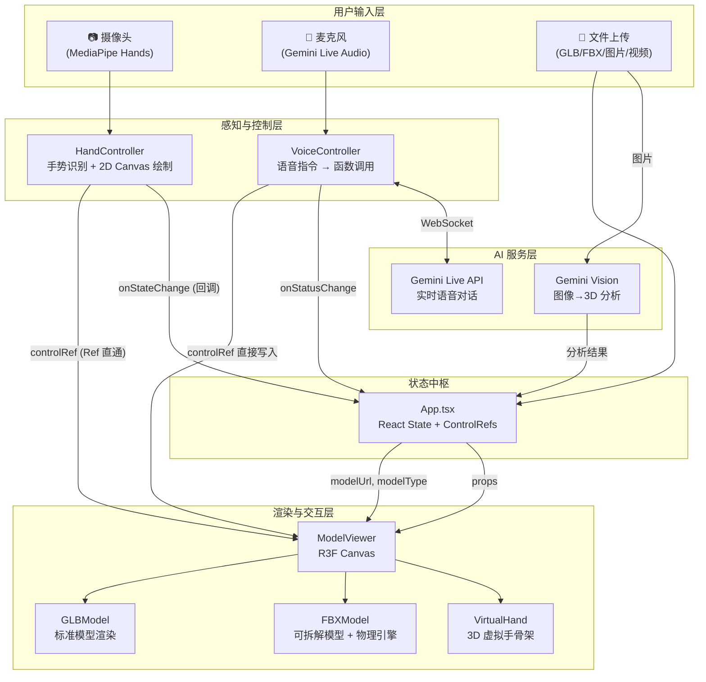
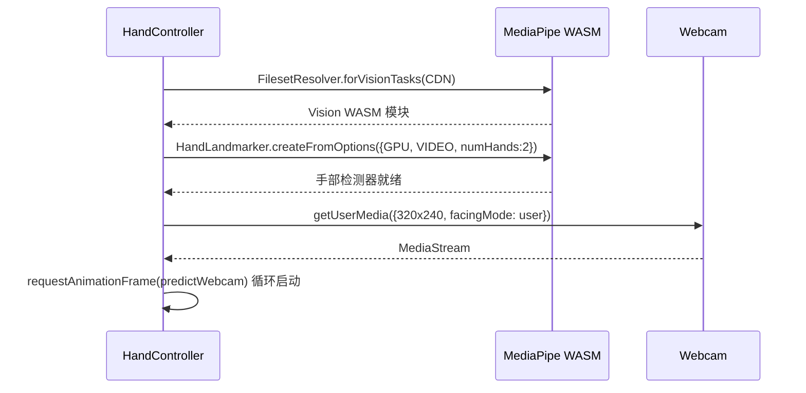
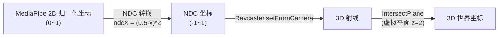
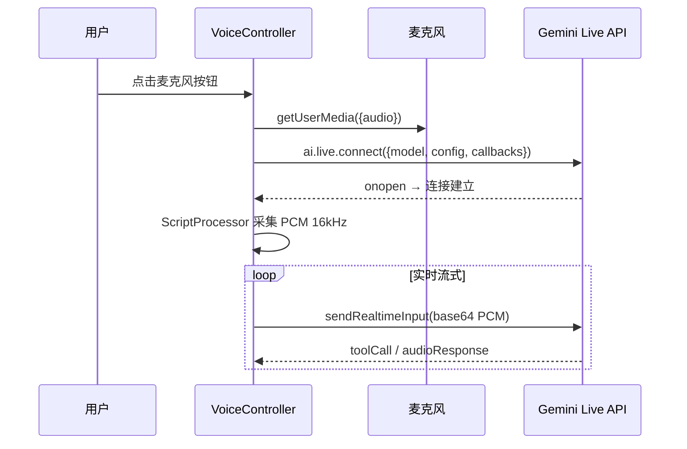
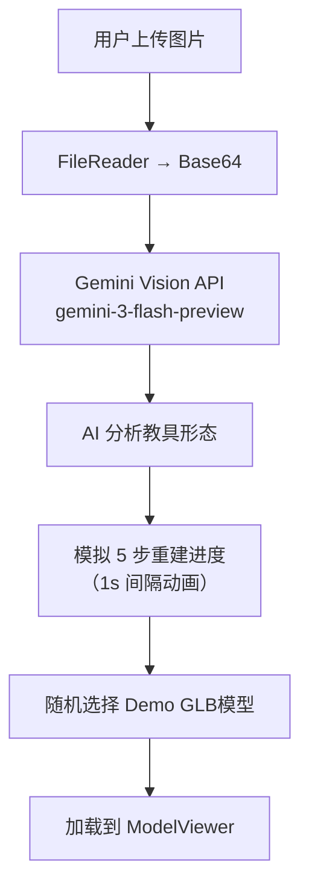
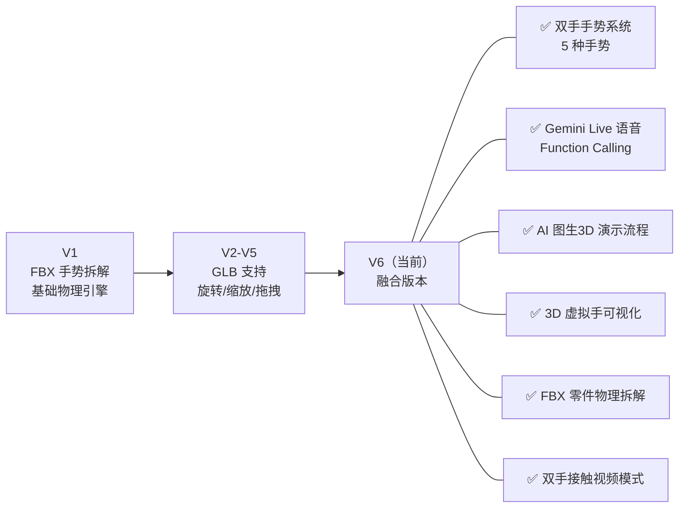

# 慧视课堂 — 技术架构与技术路线深度分析

> 项目名称：**慧视课堂 | 沉浸式 3D 互动教具库**
> 版本标识：`v3.7.0-FINGER-CTRL`（第六版本 融合）
> 分析基准：项目全部源码（10 个源文件 + 配置文件）

---

## 一、技术栈总览

| 层级 | 技术 | 版本 | 用途 |
|------|------|------|------|
| **前端框架** | React | ^19.2.1 | UI 组件体系 & 状态管理 |
| **类型系统** | TypeScript | ~5.8.2 | 静态类型检查，`jsx: react-jsx` |
| **构建工具** | Vite | ^6.2.0 | 开发服务器 & 生产打包 |
| **3D 引擎** | Three.js | ^0.181.2 | WebGL 3D 渲染核心 |
| **3D React 桥接** | @react-three/fiber | ^9.4.2 | React 声明式 Three.js |
| **3D 辅助库** | @react-three/drei | ^10.7.7 | 环境光、阴影、相机控制等 |
| **手势识别** | @mediapipe/tasks-vision | ^0.10.22-rc | 实时手部 21 关节点检测 |
| **AI 大模型** | @google/genai | ^0.8.0 | Gemini 图像分析 + Live 语音 API |
| **CSS 框架** | TailwindCSS | CDN 版本 | 原子化 CSS 样式 |
| **图标库** | lucide-react | ^0.556.0 | 矢量图标组件 |
| **字体** | Inter + Noto Sans SC | Google Fonts | 英中双语排版 |

---

## 二、项目文件结构

```
第六版本 融合/
├── index.html                # HTML 入口（TailwindCSS CDN、全局 CSS 变量、Google Fonts）
├── index.tsx                 # React 应用挂载点（createRoot + StrictMode）
├── App.tsx                   # 主应用组件（状态管理、布局编排、文件上传、AI 图生 3D）
├── types.ts                  # 共享类型（GestureType、MoveDirection、ControlRefs）
├── metadata.json             # 项目元数据（权限声明：camera + microphone）
├── components/
│   ├── HandController.tsx    # MediaPipe 手势识别控制器
│   ├── ModelViewer.tsx       # Three.js / R3F 3D 渲染器（GLB + FBX + 物理引擎 + 虚拟手）
│   ├── UIComponents.tsx      # 通用 UI 组件（Button、Badge、ProcessingOverlay）
│   └── VoiceController.tsx   # Gemini Live API 语音控制器
├── package.json              # 依赖配置
├── tsconfig.json             # TypeScript 编译配置
└── vite.config.ts            # Vite 构建配置（环境变量注入、路径别名）
```

---

## 三、整体架构图



---

## 四、核心数据流分析

### 4.1 控制信号的"Ref 直通"模式

项目采用了一种**绕过 React 渲染周期的高性能数据传递模式**——`controlRef`：

```typescript
// types.ts
export interface ControlRefs {
  rotationVelocity: { x: number; y: number };  // 旋转速度
  zoomSpeed: number;                            // 缩放速度 (-1 ~ 1)
  panPosition: { x: number; y: number };        // 拖拽目标位置
  isDragging: boolean;                          // 是否拖拽中
  handLandmarks: {                              // 手部 21 关节 3D 坐标
    left: { x: number; y: number; z: number }[] | null;
    right: { x: number; y: number; z: number }[] | null;
  };
}
```

**数据流向**：
1. `HandController` → **直接写入** `controlRef.current`（每帧 ~30fps，无 setState）
2. `VoiceController` → **直接写入** `controlRef.current`（语音触发时）
3. `ModelViewer` 的 `useFrame` → **每帧读取** `controlRef.current`（~60fps）

> [!TIP]
> 使用 `useRef` 而非 `useState` 传递高频控制信号，避免每帧触发 React 重渲染，是 R3F 应用的标准高性能模式。

### 4.2 UI 状态的 React State 模式

低频 UI 状态通过标准 React `useState` + `useCallback` 管理：

| 状态 | 类型 | 触发源 | 用途 |
|------|------|--------|------|
| `modelUrl` | `string \| null` | 文件上传 / Demo 加载 | 模型 URL |
| `modelType` | `'glb' \| 'fbx'` | 文件上传 | 渲染策略分支 |
| `gestureStatus` | `GestureType` | HandController 回调 | UI 手势状态显示 |
| `isVideoMode` | `boolean` | 双手接触手势 | 视频/3D 切换 |
| `isProcessing` | `boolean` | AI 图生 3D 流程 | 加载遮罩 |
| `aiAnalysis` | `string` | 多处 | 助教日志消息 |
| `cameraActive` | `boolean` | 用户按钮 | 摄像头开关 |

---

## 五、组件深度分析

### 5.1 HandController.tsx（手势识别控制器）

**技术路线**：MediaPipe Tasks Vision → GPU 推理 → 手部 21 关节点 → 手势分类 → 控制信号输出

#### 初始化流程


#### 手势识别逻辑（5 种手势枚举）

| 手势 | 枚举值 | 检测条件 | 控制效果 |
|------|--------|----------|----------|
| **双手接触** | `DUAL_HAND_CONTACT` | 双手腕距 < 0.12（带迟滞 ×1.3） | 切换视频模式 |
| **左手双指旋转** | `LEFT_TWO_FINGER_ROTATE` | 食+中指距 < 0.05 且均伸直 | 写入 `rotationVelocity`（Delta 计算） |
| **左手捏合拖拽** | `RIGHT_PINCH_DRAG` | 拇+食指距 < 0.05 | 写入 `panPosition` + `isDragging` |
| **右手张开放大** | `ZOOM_IN_PALM` | 四指均伸直 | `zoomSpeed = +0.35` |
| **右手握拳缩小** | `ZOOM_OUT_FIST` | 四指均弯曲 | `zoomSpeed = -0.35` |

**关键算法**：
- **低通滤波 (Lerp)**：`lerp(start, end, factor)` 平滑坐标抖动
- **自适应平滑因子**：`Math.min(0.85, Math.max(0.1, movementDelta * 15))`，快速运动响应快，静止时更平滑
- **迟滞阈值 (Hysteresis)**：双手接触使用施密特触发器逻辑，进入阈值 0.12，退出阈值 0.156，防闪烁
- **死区 (Deadzone)**：旋转 Delta < 0.002 时忽略，防止微颤

#### Canvas 绘制
- 使用 `DrawingUtils` 在 2D Canvas 上绘制手部骨架
- 左手：`#ffddca`（樱花粉），右手：`#86e3ce`（薄荷绿）
- Canvas 通过 `ctx.scale(-1, 1)` 做**镜像翻转**

---

### 5.2 ModelViewer.tsx（3D 渲染核心）

**技术路线**：React Three Fiber Canvas → Three.js WebGL → GLB/FBX 模型加载 → 手势驱动交互 + 物理模拟

#### R3F Canvas 配置
```typescript
<Canvas
  shadows                                        // 阴影开启
  dpr={[1, 2]}                                   // 设备像素比自适应
  camera={{ position: [0, 2, 6], fov: 45 }}     // 初始视角
  gl={{ antialias: true, toneMapping: THREE.ACESFilmicToneMapping }}  // ACES 色调映射
  raycaster={{ far: 100 }}                       // 射线最远距离
>
```

#### 光照系统
| 光源 | 参数 | 作用 |
|------|------|------|
| `ambientLight` | intensity=0.6 | 全局基底照明 |
| `spotLight` | pos=[10,10,10], angle=0.15, penumbra=1, castShadow | 主光源 + 投影 |
| `pointLight` | pos=[-10,-10,-10], intensity=0.5 | 补光 |
| `Environment` | preset="studio", blur=0.8 | HDR 环境贴图（Studio 预设） |
| `ContactShadows` | opacity=0.4, blur=2.5 | 接触阴影（性能友好） |

#### 子组件 A：GLBModel（标准模型）

- **加载**：`useGLTF(url)` → drei 内置 GLTF 加载器
- **自动缩放**：计算 BoundingBox → 归一化到 3.5 单位
- **材质增强**：遍历所有 Mesh，设置 `envMapIntensity = 1.2`、启用 castShadow/receiveShadow
- **交互**：
  - **旋转**：读取 `rotationVelocity` → Lerp 平滑(0.2) → 累加到 `rotation.x/y`
  - **缩放**：读取 `zoomSpeed` → Lerp 到新 scale → 钳制 [0.4, 6.0]
  - **拖拽**：读取 `panPosition` → Lerp(0.75) 追踪目标位置；释放时 Lerp(0.05) 回弹
  - **待机动画**：无手势时，`sin(time*0.3)*0.001` 微摆

#### 子组件 B：FBXModel（可拆解模型 + 物理引擎）

**核心特色**：一比一复刻第一版的手部零件拆解系统。

**FBX 加载流程**：
1. `FBXLoader.load(url)` → 加载 FBX 文件
2. 计算 BoundingBox → 归一化到 2 单位
3. 遍历所有 Mesh → 记录 `originalPosition`、初始化 `velocity` → 收集到 `modelParts[]`

**手部 3D 投影算法**（关键创新）：


**捏合检测（施密特触发器）**：
- 进入阈值：归一化捏合距离 < 0.4
- 退出阈值：归一化捏合距离 > 0.6
- 优先级：握拳 > 捏合 > 张开

**抓取与拖拽流程**：
1. 捏合检测 → Raycaster 射线投射 → 命中最近 Mesh
2. 将零件从 FBX 组中**移出**到场景根节点（保持世界坐标）
3. 设置拖拽平面（与相机法线正交，过零件位置）
4. 每帧用射线-平面交点更新零件位置
5. 释放时：赋予手部速度（投掷），加入物理列表

**物理引擎**（自实现）：
```typescript
// 参数
gravity = -9.8;     // 重力加速度
restitution = 0.3;  // 弹性系数
friction = 0.8;     // 摩擦系数
groundLevel = 0;    // 地面高度
subSteps = 3;       // 子步数（提高稳定性）

// 每帧循环
velocity.y += gravity * subDt;
position += velocity * subDt;
if (bottomY < ground) → 反弹 + 摩擦减速 + 静止检测
```

**旋转控制（FBX 专用）**：
- 不同于 GLB 的模型自转，FBX 采用**相机轨道旋转**
- 将相机位置转为球坐标 → 修改 `theta/phi` → 限制仰角 [0.1, π-0.1] → 回写相机

#### 子组件 C：VirtualHand（3D 虚拟手骨架）

- 为每只手创建 21 个 `SphereGeometry(0.03)` 关节点球 + 23 条 `Line` 连线
- 左手颜色：`#ffddca`（暖粉），右手：`#86e3ce`（薄荷绿）
- 拇指/食指特殊高亮：`#ff6b6b` / `#4ecdc4`
- 每帧读取 `controlRef.current.handLandmarks` → NDC 投影到虚拟平面(z=3) → 更新位置

#### 子组件 D：Ground（地面平面）
- `PlaneGeometry(20,20)` 半透明灰色地面，接收阴影

---

### 5.3 VoiceController.tsx（语音控制器）

**技术路线**：Gemini Live API (WebSocket) → 实时双工语音 → Function Calling → 模型控制

#### 连接流程


#### AI 模型配置
- **模型**：`gemini-2.5-flash-native-audio-preview-12-2025`
- **响应模态**：`Modality.AUDIO`（纯语音回复）
- **System Prompt**：3D 课堂助教角色，简洁亲切回复

#### Function Calling 工具定义

| 函数名 | 描述 | 控制效果 |
|--------|------|----------|
| `zoom_in` | 放大 3D 模型 | `controlRef.current.zoomSpeed = 0.015` |
| `zoom_out` | 缩小 3D 模型 | `controlRef.current.zoomSpeed = -0.015` |
| `rotate` | 自动旋转 | `rotationVelocity = {x:0, y:0.02}` |
| `stop` | 停止所有动作 | 归零 zoomSpeed + rotationVelocity |

> [!NOTE]
> 缩放指令带 **1.5 秒自动停止**：`setTimeout(() => zoomSpeed = 0, 1500)`，防止无限放大。

#### 音频处理管线
- **输入**：16kHz 采样 → `ScriptProcessor(4096)` → Float32→Int16→Base64 → 发送
- **输出**：接收 Base64 → Int16→Float32 → `AudioBuffer(24kHz)` → `BufferSource` 播放

---

### 5.4 App.tsx（主应用编排器）

#### 核心职责
1. **全局状态管理**：管理模型 URL、手势状态、AI 分析日志等
2. **文件上传**：支持 GLB / FBX / 图片 / 视频四种文件类型
3. **AI 图生 3D**：上传图片 → Gemini Vision 分析 → 模拟重建步骤 → 加载示例模型
4. **布局编排**：导航栏 + 侧边栏 + 3D 视口 + 摄像头预览
5. **视频模式切换**：双手接触 → 全屏视频播放

#### AI 图生 3D 流程


> [!IMPORTANT]
> 当前 AI 图生 3D 是**演示流程** — AI 分析图片是真实的（调用 Gemini），但最终加载的 3D 模型是预设的 KhronosGroup 示例（DamagedHelmet / BoomBox）。

---

### 5.5 UIComponents.tsx（UI 基础组件）

| 组件 | 用途 |
|------|------|
| `Button` | 通用圆角按钮，支持 active:scale-95 微动画 |
| `Badge` | 状态标签（emerald/blue/orange/purple 四色） |
| `ProcessingOverlay` | 全屏毛玻璃加载遮罩，显示 5 步 AI 重建进度 |

---

## 六、构建与配置详解

### 6.1 Vite 配置 ([vite.config.ts](file:///c:/Users/yuyiling/Desktop/可视化交互/第六版本%20融合/vite.config.ts))

```typescript
export default defineConfig(({ mode }) => {
  const env = loadEnv(mode, '.', '');
  return {
    server: { port: 3000, host: '0.0.0.0' },           // 局域网可访问
    plugins: [react()],                                  // @vitejs/plugin-react
    define: {
      'process.env.API_KEY': JSON.stringify(env.GEMINI_API_KEY),  // 环境变量注入
      'process.env.GEMINI_API_KEY': JSON.stringify(env.GEMINI_API_KEY)
    },
    resolve: { alias: { '@': path.resolve(__dirname, '.') } }     // @ 别名→项目根
  };
});
```

### 6.2 TypeScript 配置 ([tsconfig.json](file:///c:/Users/yuyiling/Desktop/可视化交互/第六版本%20融合/tsconfig.json))

- 目标：`ES2022` + `DOM` + `DOM.Iterable`
- 模块：`ESNext` + `bundler` 解析模式
- JSX：`react-jsx`（自动导入 React）
- `allowImportingTsExtensions: true`  + `noEmit: true`（仅类型检查，不生成 JS）
- 路径别名：`@/*` → `./*`

### 6.3 全局样式 ([index.html](file:///c:/Users/yuyiling/Desktop/可视化交互/第六版本%20融合/index.html))

- CSS 变量：`--miku-blue: #86e3ce`、`--sakura-pink: #ffddca`、`--lemon-yellow: #fae1aa`
- 背景渐变：`135deg, #e0f7fa → #fce4ec`
- 玻璃态 `.glass-panel`：`rgba(255,255,255,0.7)` + `backdrop-filter: blur(16px)`
- 侧边栏悬浮：`translateX(4px)` + `cubic-bezier(0.4, 0, 0.2, 1)` 过渡

---

## 七、关键设计模式总结

| 设计模式 | 应用场景 | 实现方式 |
|----------|----------|----------|
| **Ref 直通** | 高频控制信号传递 | `useRef<ControlRefs>` 绕过 React 渲染 |
| **施密特触发器** | 手势状态防抖 | 进入/退出使用不同阈值 |
| **自适应 Lerp** | 坐标平滑 | 根据运动速度动态调整平滑因子 |
| **虚拟平面投影** | 2D→3D 坐标映射 | NDC→Raycaster→射线-平面交点 |
| **场景节点提升** | 零件独立物理 | `parent.remove()` → `scene.add()` 保持世界坐标 |
| **子步物理积分** | 碰撞稳定性 | 3 子步 Euler 积分 + 穿透修正 |
| **Function Calling** | 语音→模型控制 | Gemini Live API 工具声明 + 回调执行 |
| **双模态融合** | 手势 + 语音并行控制 | 共享 `controlRef`，互不冲突 |

---

## 八、技术路线图（版本演进推断）



---

## 九、外部依赖与网络请求

| 资源 | URL | 用途 |
|------|-----|------|
| MediaPipe WASM | `cdn.jsdelivr.net/npm/@mediapipe/tasks-vision@0.10.0/wasm` | 手部检测推理 |
| MediaPipe 模型 | `storage.googleapis.com/.../hand_landmarker.task` | Float16 手部关节模型 |
| Demo 3D 模型 | `raw.githubusercontent.com/KhronosGroup/glTF-Sample-Models/...` | DamagedHelmet / BoomBox |
| TailwindCSS | `cdn.tailwindcss.com` | CSS 框架 |
| Google Fonts | `fonts.googleapis.com` | Inter + Noto Sans SC |
| Font Awesome | `cdnjs.cloudflare.com/ajax/libs/font-awesome/6.0.0` | 补充图标 |
| Gemini API | Google AI Studio | 图像分析 + 语音对话 |
| DiceBear | `api.dicebear.com/7.x/adventurer/svg` | 用户头像 |
